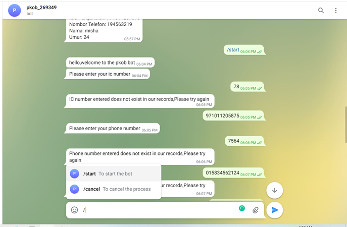
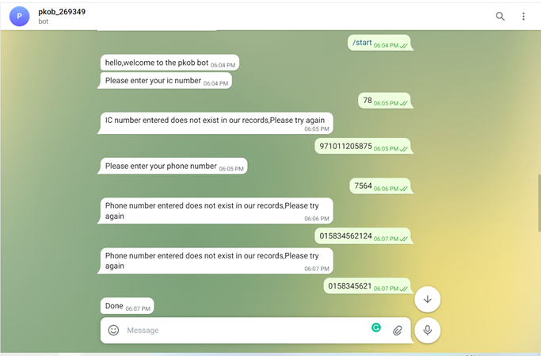
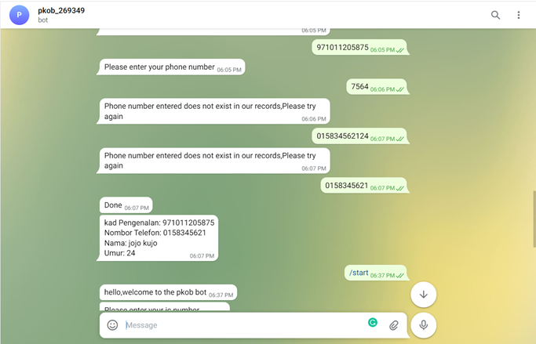
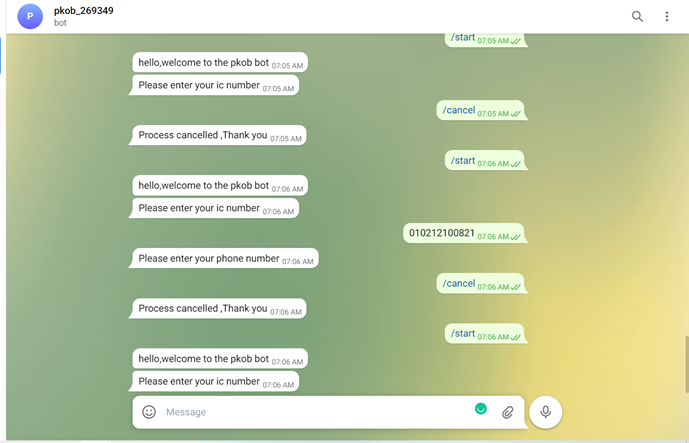

## Requirements for Assignment-2
[Read the instruction](https://github.com/STIW3054-A211/e-sulam/blob/main/Assignment-2.md)

## Your Info:
| Picture | Matric Number | Name | Phone Number |
| :---: | :---: | :---: | :---: |
 | 269349 | Idah Pindai Zengeni | 014-2456304 |

## Introduction
Pkob telegram bot is an extension of the Pusat Kawalan Operasi Bencana website.The telegram bot retrives data from the postgres database and returns the information for matching ic number and phone number.Telegram was made using Botfather and the wrapper used is the python-telegram-bot .
## Deployment Guide

## Result/Output (Screenshot of the output)

## Youtube Presentation
website

youtube

bot
https://t.me/pkob_269349_bot
## List of Python packages (including the version) used for this system
APScheduler           3.6.3
asgiref               3.4.1
cachetools            4.2.2
certifi               2021.10.8
charset-normalizer    2.0.9
current               0.4
Django                3.2.8
gunicorn              20.1.0
idna                  3.3
pip                   21.1.2
psycopg2              2.9.2
python-telegram-bot   13.8.1
pytz                  2021.3
pytz-deprecation-shim 0.1.0.post0
requests              2.26.0
setuptools            57.0.0
six                   1.16.0
sqlparse              0.4.2
tornado               6.1
tzdata                2021.5
tzlocal               4.1
urllib3               1.26.7
wheel                 0.36.2

## References (Not less than 10)
1.python-telegram-bot. (n.d.). Python-Telegram-Bot. https://python-telegram-bot.org/
2.P. (2021, July 10). Telegram Bot Tutorial Python Heroku [Video]. YouTube. https://www.youtube.com/watch?v=fQo_327-AZA&feature=youtu.be
3.Q. (2020, December 29). Telegram ChatBOT. . .. [Video]. YouTube. https://www.youtube.com/watch?v=SeDvHHltw_Q&feature=youtu.be
4.Ivy, D. (2020, January 27). Heroku Postgres Connection | Django (3.0) Crash Course Tutorials (pt 24) [Video]. YouTube. https://www.youtube.com/watch?v=TFFtDLZnbSs&feature=youtu.be
5.Keen, C. (2021, June 18). Python django telegram bot | Telegram bot using django | Telegram bot tutorial | [ telegram bot ] [Video]. YouTube. https://www.youtube.com/watch?v=I3Kr46sRDK4&feature=youtu.be
6.Long Polling vs. Webhooks | grammY. (n.d.). Grammy. https://grammy.dev/guide/deployment-types.html#how-to-use-long-polling
7.Date/Time Types. (2016, October 27). PostgreSQL Documentation. https://www.postgresql.org/docs/9.1/datatype-datetime.html
8.Rpns, S. (2021, August 21). Django No Module Named Psycopg2 when Launching Migrations to Heroku. OOKS Crypto Currency. https://www.onooks.com/django-no-module-named-psycopg2-when-launching-migrations-to-heroku/
9.How to show options in telegram bot? (2015, December 24). Stack Overflow. https://stackoverflow.com/questions/34457568/how-to-show-options-in-telegram-bot
10.H. (2021a, December 14). How to Deploy a Telegram Bot using Heroku for FREE - Towards Data Science. Medium. https://towardsdatascience.com/how-to-deploy-a-telegram-bot-using-heroku-for-free-9436f89575d2